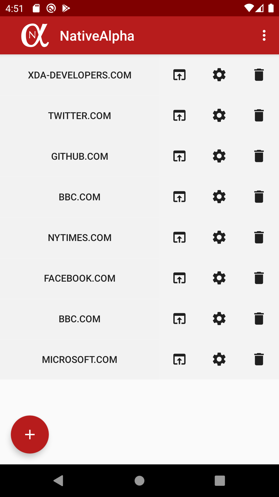
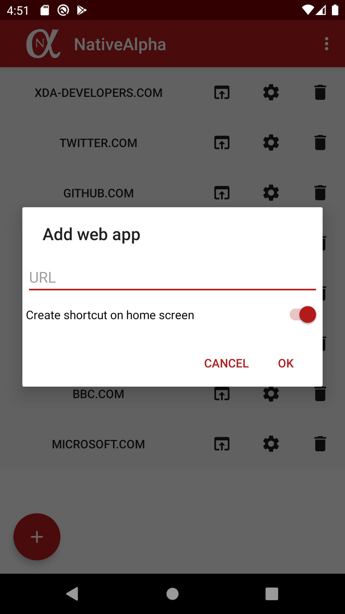
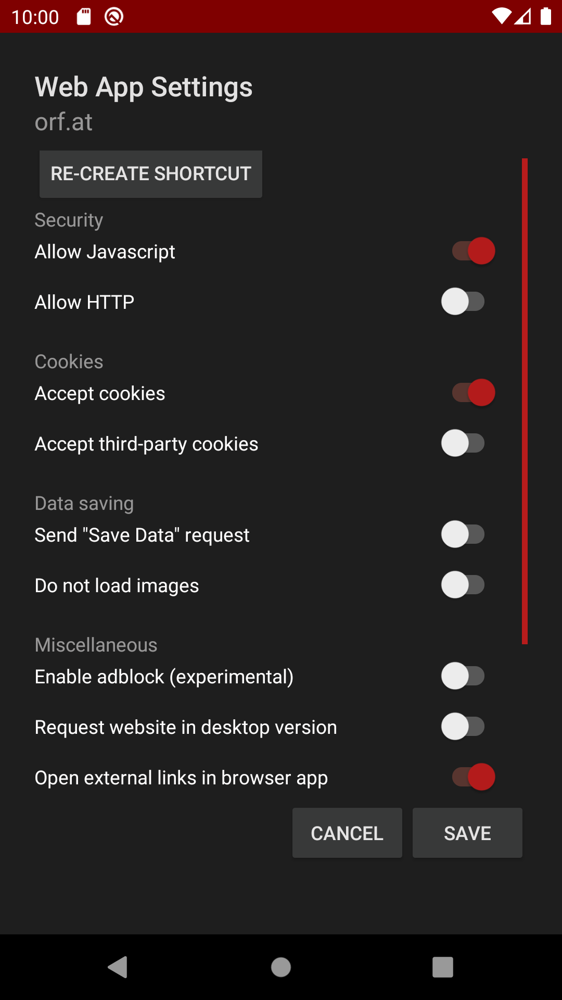
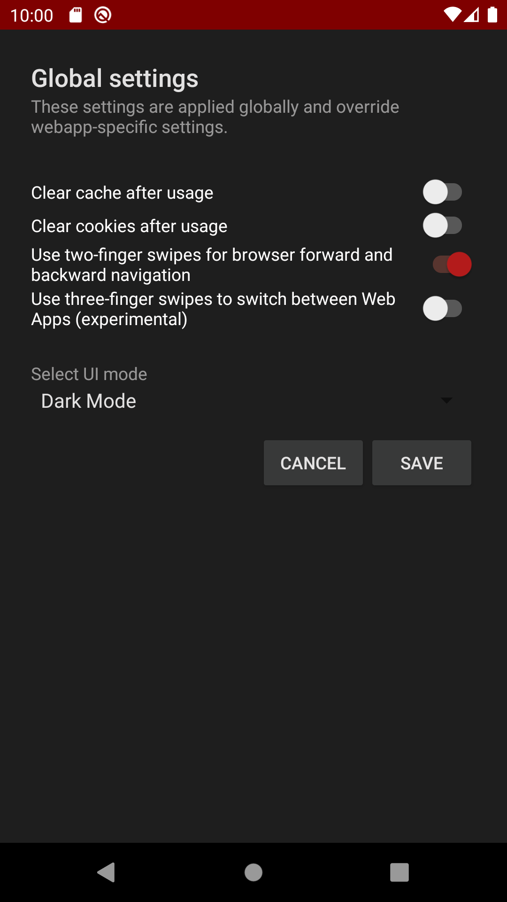

# </img> Native Alpha

## Features
  * Show any website in a borderless full-screen window using Android System WebView.
  * Offers to create home screen shortcuts and retrieves icons in suitable resolution.
  * Various settings (JavaScript, Cookies, Third-Party-Cookies, AdBlock) can be set for every web app individually
  * Navigation with multi-touch gestures while browsing.
  * Opt-in adblock using an AdBlock Plus custom webview.
  * Less memory footprint and no privacy-invading app permissions in comparison to native apps
  * Dark mode for Android 10+

## FAQ
*Q: Why is it not possible to find an icon for a certain website?*

A: This problem can occur due to multiple reasons. In most cases, the website does not offer a high-resolution icon. If you are a website maintainer and your website icon cannot be found, look at [RealFaviconGenerator](https://realfavicongenerator.net) for further information. If you think it should work, feel free to post the URL and I will look into it.

*Q: Why would I need this app if any mobile browser can do the same?*

A: Mobile browsers usually only are able to create shortcuts which give a native, borderless fullscreen experience if the website has a Progressive Web App (PWA) manifest. Unfortunately, most websites do not offer this feature yet.

*Q: Is this a web browser?*

A: No. As stated, this app relies on the system built-in Android WebView in order to display the website. For privacy reasons, you can opt to use alternative webviews such as [Bromite](https://www.bromite.org/system_web_view) on rooted phones. Always make sure to use to most recent version of any WebView implementation you use!

*Q: Why does this app require Android Oreo?*

A: Android introduced a new shortcut API with Oreo. However, it is planned to add legacy shortcut support. Older versions should also work then.

*Q: In constrast to your promise, this app has a large memory footprint!*

A: This is because Native Alpha makes use of caching in the same way your browser app does, i.e., it saves web content locally on your device. Then it can be loaded faster if you visit the same page again. I will look into a way for better cache management. In the meantime, you can either delete cache regularly yourself or set the "Clear cache after usage" setting in the global settings if memory footprint is a concern for you. However, then websites will take a longer time to load because everything has to be loaded from net.

## Used libraries/resources
* [CircularProgressBar](https://github.com/lopspower/CircularProgressBar)
* [JSoup](https://jsoup.org/)
* [AboutPage](https://github.com/medyo/android-about-page)
* [AdBlock+WebView](https://github.com/adblockplus/libadblockplus-android)
* [MovableFloatingActionButton](https://stackoverflow.com/questions/46370836/android-movable-draggable-floating-action-button-fab)
* [Android About Page](https://github.com/medyo/android-about-page)
* [Android Databinding](https://developer.android.com/topic/libraries/data-binding)
* [AboutLibraries](https://github.com/mikepenz/AboutLibraries)

For testing purposes:
* [Robolectric](https://github.com/robolectric/robolectric)
* [Espresso](https://developer.android.com/training/testing/espresso/)

A list of used open-source libraries can also be found inside the app ("About" section).

## Screenshots

## License
Native Alpha is Free Software: You can use, study share and improve it at your
will. Specifically you can redistribute and/or modify it under the terms of the
[GNU General Public License](https://www.gnu.org/licenses/gpl.html) as
published by the Free Software Foundation, either version 3 of the License, or
(at your option) any later version.

## End user license agreement
THIS SOFTWARE IS PROVIDED BY THE AUTHOR "AS IS" AND ANY EXPRESS OR IMPLIED WARRANTIES, INCLUDING, BUT NOT LIMITED TO, THE IMPLIED WARRANTIES OF MERCHANTABILITY AND FITNESS FOR A PARTICULAR PURPOSE ARE DISCLAIMED. IN NO EVENT SHALL THE AUTHOR BE LIABLE FOR ANY DIRECT, INDIRECT, INCIDENTAL, SPECIAL, EXEMPLARY, OR CONSEQUENTIAL DAMAGES (INCLUDING, BUT NOT LIMITED TO, PROCUREMENT OF SUBSTITUTE GOODS OR SERVICES; LOSS OF USE, DATA, OR PROFITS; OR BUSINESS INTERRUPTION) HOWEVER CAUSED AND ON ANY THEORY OF LIABILITY, WHETHER IN CONTRACT, STRICT LIABILITY, OR TORT (INCLUDING NEGLIGENCE OR OTHERWISE) ARISING IN ANY WAY OUT OF THE USE OF THIS SOFTWARE, EVEN IF ADVISED OF THE POSSIBILITY OF SUCH DAMAGE.
